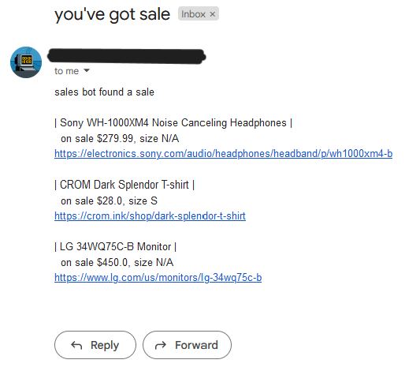
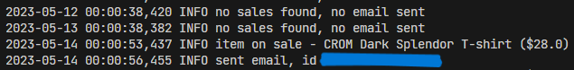

# Sales Web Scraper

A basic web scraper to check price data for a few specific items every day at midnight and email me when there's a sale - hosted on a raspberry pi zero.


## Motivation

I had a few Raspberry Pi Zero boards lying around collecting dust and have always wanted to try web scraping with the [BeautifulSoup library](https://beautiful-soup-4.readthedocs.io/en/latest/). There are individual things I wanted to buy online but didn't want to clutter my inbox by signing up to multiple email lists.

So I decided to take the long road and make a tailored sales email list from scratch.


## Output

Example email output of some of the sales found:



Example logging output for no email sent / found a sale:




## Getting Started

Hardware used:
- [Raspberry Pi Zero](https://www.raspberrypi.com/products/raspberry-pi-zero-w/)
- MicroSD card
- Micro USB power supply

Software used:
- [Raspberry Pi Imager](https://www.raspberrypi.com/software/) on local machine (to flash OS to MicroSD card)

---

Steps to do before installation:
1. Set up a Google Cloud project (this lets you send emails with their API):
   - decide on creating a new Gmail account (recommended) or using an existing one
   - follow steps to create a [Google Cloud project](https://cloud.google.com/resource-manager/docs/creating-managing-projects)
   - follow [this quickstart guide](https://developers.google.com/gmail/api/quickstart/python)
   - double check you downloaded the `credentials.json` file (APIs & Services > Credentials > OAuth 2.0 Client IDs > Download JSON)

2. Use the Raspberry Pi Imager to flash the recommended OS to the MicroSD card, then power on the Pi Zero.
   - create username and password
   - enable SSH
   - add your wifi network info, otherwise you'll have to add a [wpa_supplicant.conf file](https://www.raspberrypi.com/documentation/computers/configuration.html#configuring-networking) to the MicroSD card after flashing

3. To find the IP address of the Pi Zero, [you can use nmap](https://lindevs.com/find-all-devices-connected-to-local-network-using-nmap). Open a terminal, then:
   - install nmap with `sudo apt-get install nmap`
   - for linux run `ip addr show`, for windows run `ipconfig` - look for IPv4 Address ... `192.168.<THIS>.<something>`
   - run `nmap -sn 192.168.<THIS>.0/24`
   - the output should include:
     ```
      Nmap scan report for <ip address>
      Host is up (0.13s latency).
      MAC Address: <mac address> (Raspberry Pi Foundation)
     ```
     Write down the `<ip address>`.

4. SSH into your Pi Zero with:
   ```
    ssh pi@<ip address>
    ...
    pi@raspberrypi:~ $
   ```


## Installation

Steps to get the project running on your Pi Zero.

1. To get the code, SSH into your pi and then:
   - choose directory to store project, e.g. `cd Documents/`
   - clone the project - `git clone https://github.com/chrisalexman/sales-web-scraper.git`
   - enter project folder `cd sales-web-scraper/`

2. Create credentials file using vim, paste in the credentials from before.
   ```
    vim credentials.json
   ```
   Then create and save a blank file for `token.json`

3. Create the `email_info.py` file, paste in the following function with your `<gmail address>` below:
   ```
    def get_email():
        return '<gmail address>'
   ```

4. Set up crontab to have the script run automatically. In the terminal, run `crontab -e` and add this to the bottom of the file:
   ```
    0 0 * * * cd /home/pi/Documents/sales-web-scraper && /usr/bin/python3 main.py
   ```
   This means the script will run every day at midnight. NOTE the paths for your own setup.

5. This step is to authorize the application but it cannot be done on the Pi Zero over SSH to my knowledge. Please follow steps 1-3 above to get the project on your local machine, then:
   - run `python3 main.py` from the sales-web-scraper directory
   - click the link that says `Please visit this URL to authorize this application:`
   - authorize the application in the browser
   - a `token.json` file will be created in your root project directory

6. Back to the Pi Zero:
   - create a `token.json` file, paste in the contents of the file created previously
   - run `pip install -r requirements.txt` to install requirements

7. To run the project and check the output created with [Python logging](https://docs.python.org/3/howto/logging.html):
   - run `python3 main.py`, this will take ~1 minute
   - look at the output with `cat output.log`, it will differ for which items you have / if a sale was found:
     ```
      2023-05-01 00:00:32,296 INFO no sales found, no email sent

      OR

      2023-05-27 00:00:57,082 INFO item on sale - Sony WH-1000XM4 Noise Canceling Headphones ($279.99)
      2023-05-27 00:00:57,088 INFO item on sale - CROM Dark Splendor T-shirt ($28.0)
      2023-05-27 00:00:57,089 INFO item on sale - LG 34WQ75C-B Monitor ($450.0)
      2023-05-27 00:01:00,096 INFO sent email, id <email id>
     ```


## How to Use

Manually - run `python3 main.py` in the terminal, then check the output with `cat output.log`.

Automatically:
- the code will run every night at midnight with crontab, but can be adjusted for your needs
- it will only send an email if a sale was found
- you can SSH into the Pi Zero and check the output with `cat output.log`, or even email yourself this file periodically
- you can edit the functions for items to check, but will have to find the name, price, and size data from the HTML using [BeautifulSoup](https://beautiful-soup-4.readthedocs.io/en/latest/)


## License

[MIT](https://github.com/chrisalexman/sales-web-scraper/blob/main/LICENSE)
